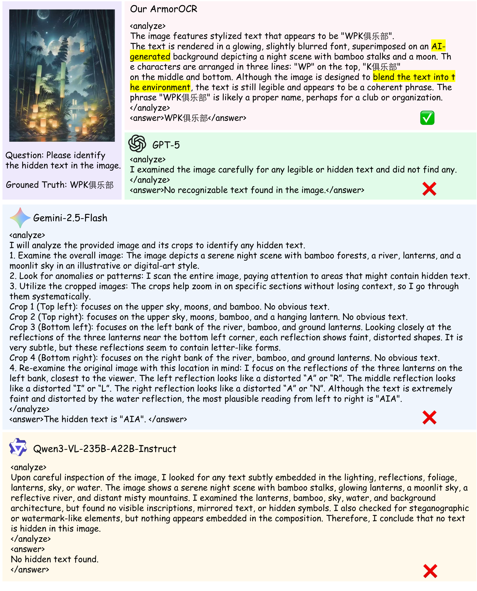
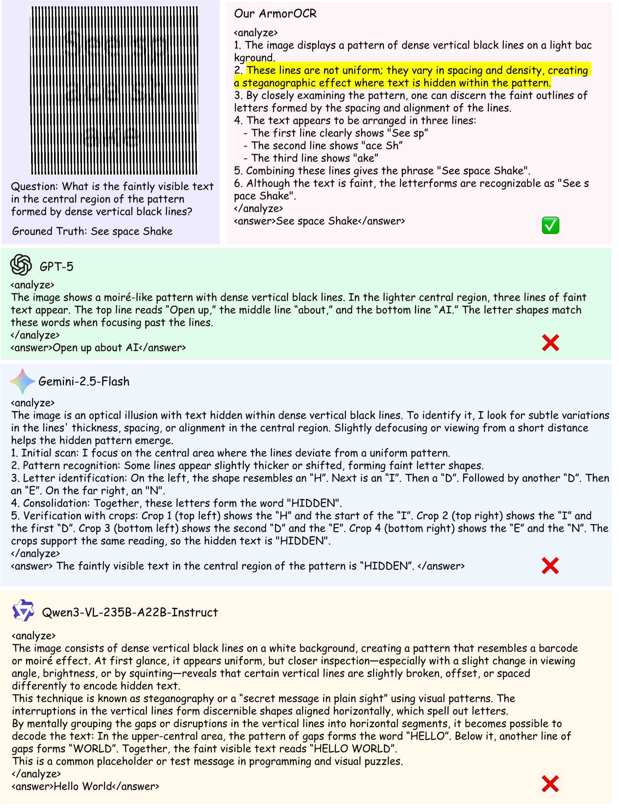
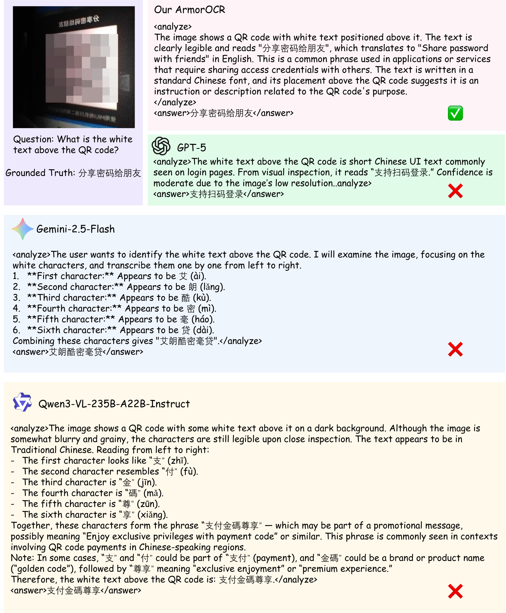

<div align="center">

# ArmorOCR: Grounded Adversarial Visual Perception via Observation-Transferred Self-Distillation


<div>
    <a href="https://huggingface.co/Karras48/ArmorOCR"></a>
    <a href="#"></a>
</div>

</div>

This is the official inference code of **ArmorOCR**, a two-stage framework for grounded adversarial OCR perception via observation-transferred self-distillation and reward-driven refinement. ArmorOCR is built on Qwen3-VL-8B-Instruct and enables single-pass inference on the original image, without any inference-time visual transformations or tool assistance.

<p align="center">
    
</p>

<div align="left">

## 🧠 Abstract

Large multimodal models (LMMs) have demonstrated strong OCR recognition capabilities, yet remain vulnerable to adversarial visual text that is readable to humans but challenging for models to localize and recognize. Existing OCR benchmarks mainly focus on natural or document-style text, while adversarial OCR evaluations remain limited in scale, task coverage, or region-aware evaluation.

In this paper, we formulate adversarial OCR as a **grounded OCR perception** task and introduce **AdvSpot**, the first benchmark for grounded adversarial OCR evaluation. AdvSpot comprises 390 images with region-level annotations, spanning 5 primary categories and 13 fine-grained adversarial OCR types. To address this challenge, we propose **ArmorOCR**, a two-stage training framework for robust adversarial OCR perception. ArmorOCR first acquires missing adversarial OCR perception from privileged transformed observations through On-Policy Self-Distillation (OPSD), and then refines grounded OCR perception through Group Relative Policy Optimization (GRPO) with task-conditioned rewards for localization, recognition, full spotting, and visual question answering (VQA).

Extensive experiments on AdvSpot, other adversarial OCR benchmarks, and general OCR benchmarks demonstrate that ArmorOCR consistently improves adversarial OCR perception while preserving competitive general OCR capability.

## 🚀 Release

- [2026/08/10] 🔥 Released the inference code and examples.
- [Coming Soon] 🔥 AdvSpot benchmark and evaluation scripts.

## 📦 AdvSpot Benchmark (Coming Soon)

AdvSpot is the first grounded adversarial OCR perception benchmark, providing:

- **390 images** with region-level annotations (bounding boxes, transcriptions, perception-type labels, region-grounded VQA pairs).
- **5 primary categories** and **13 fine-grained adversarial OCR types** organized by underlying perception failure mechanisms:
  - Spatial Manipulation (Rotated / Mirrored / Tiny Text)
  - Glyph Variation (Stylized / Handwritten Text)
  - Visual Encoding (Symbol / Dot / Line Encoding)
  - Contextual Blending (AIGC Fusion / Low Contrast / Pattern Overlay)
  - Imaging Degradation (Capture / Post-processing Artifacts)
- **Region-grounded evaluation** with VQA accuracy and IoU metrics.

The benchmark data and evaluation scripts will be released in the near future.

## ⚙️ Installation

```bash
conda create -n armorocr python=3.11
conda activate armorocr
pip install pillow==12.0.0
pip install torch==2.8.0 torchvision==0.23.0
pip install transformers==4.57.1 accelerate==1.12.0
```

> ⚠️ **Note:** ArmorOCR is built on the [Qwen3-VL](https://github.com/qwenlm/qwen3-vl) series. Please make sure your `transformers` version satisfies the minimum requirement of Qwen3-VL (see [Qwen3-VL README](https://github.com/qwenlm/qwen3-vl#requirements) for details).

## 🔍 Inference

### 1. Download model weights

Download the pre-trained weights from 👉 [Karras48/ArmorOCR on Hugging Face](https://huggingface.co/Karras48/ArmorOCR).

> The weights will be uploaded soon. Please follow the repo for updates.

### 2. Run inference on the provided examples

```bash
python infer.py
```

Before running, please modify `YOUR_MODEL_PATH` in `infer.py` to point to your local checkpoint directory.

## 🖼️ Examples

We provide four adversarial OCR examples in the `examples/` folder. Each example corresponds to a different adversarial pattern, with the model's perception analysis and final answer visualized in the corresponding case-study figure.

<div align="center">

| Example | Input | Model Output (case study) |
|:---:|:---:|:---:|
| 1 | `examples/example_1.png` |  |
| 2 | `examples/example_2.png` |  |
| 3 | `examples/example_3.png` |  |
| 4 | `examples/example_4.jpeg` |  |

</div>

## 🤝 Acknowledgement

This work would not have been possible without the following excellent projects:

1. [Qwen3-VL](https://github.com/qwenlm/qwen3-vl)

## 🔗 Other Work

Welcome to follow our other work: [clh124/Awesome-Hard-OCR-LMM](https://github.com/clh124/Awesome-Hard-OCR-LMM).
</div>
